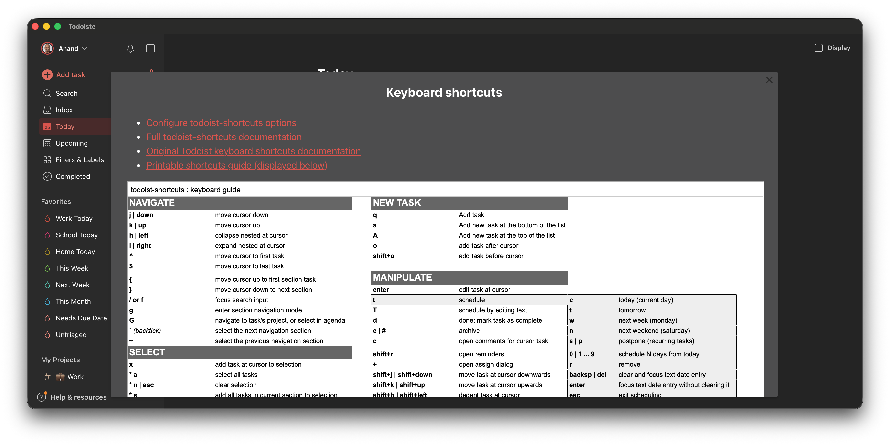

# Todoiste

A native macOS app for [Todoist](https://todoist.com) with full keyboard shortcuts, powered by [todoist-shortcuts](https://github.com/mgsloan/todoist-shortcuts).

Todoiste wraps Todoist's web app in a lightweight WKWebView and injects the todoist-shortcuts extension as plain JavaScript — no browser required. You get a real Mac app (Dock icon, Cmd+Tab, native window management) with the full suite of Gmail/vim-inspired keyboard shortcuts.



## Why?

Todoist's official Mac app doesn't support the todoist-shortcuts extension. Using it in Chrome works, but the tab lives among dozens of others and doesn't feel like a standalone app. Browser-to-app wrappers like Coherence X get close but have quirks. Todoiste is ~100 lines of Swift that gives you the real thing.

## Installing

Download the latest `Todoiste.dmg` from
[Releases](https://github.com/anandman/Todoiste/releases), open it, and drag
Todoiste to Applications.

The build is signed ad-hoc, not with a Developer ID, so macOS will refuse to
open it the first time. Right-click the app and choose **Open**, or go to
System Settings → Privacy & Security and click **Open Anyway**. After that it
launches normally.

To build and install from source instead:

```bash
xcodegen generate   # see Building below if you don't have xcodegen
xcodebuild -project Todoiste.xcodeproj -scheme Todoiste -configuration Release \
  -derivedDataPath build build
rm -rf /Applications/Todoiste.app
ditto build/Build/Products/Release/Todoiste.app /Applications/Todoiste.app
```

`/Applications/Todoiste.app` is a copy, so rerun those last two lines after any
change to the Swift source — building in Xcode alone will not update it.

## Building

### Prerequisites

- macOS 14+ (Sonoma or later)
- Xcode 15+
- [xcodegen](https://github.com/yonaskolb/XcodeGen) (optional but recommended)

### With xcodegen

```bash
brew install xcodegen
cd Todoiste
xcodegen generate
open Todoiste.xcodeproj
# Cmd+R to build and run
```

Or from the command line:

```bash
xcodegen generate
xcodebuild -project Todoiste.xcodeproj -scheme Todoiste -configuration Debug \
  -derivedDataPath build build
open build/Build/Products/Debug/Todoiste.app
```

### Without xcodegen (building from scratch, not from a clone)

The `.xcodeproj` is gitignored since it's generated by xcodegen. If you don't want to install xcodegen, you can recreate the project manually:

1. Open Xcode → File → New → Project → macOS → App (SwiftUI, Swift)
2. Replace the generated files with `TodoisteApp.swift`, `WebView.swift`, and `SettingsView.swift`
3. Add `Todoiste/Resources/` to the target so the `.js` files are copied to **Copy Bundle Resources** (ensure "Copy items if needed" and "Add to target: Todoiste" are checked)
4. Add `Todoiste/Assets.xcassets` to the target (for app icon/assets)
5. Use `Todoiste.entitlements` as the entitlements file
6. Build and run

## How It Works

The Chrome extension injects two scripts into `todoist.com/app`: [mousetrap.js](https://github.com/mgsloan/mousetrap) (keyboard event library) and todoist-shortcuts.js (the shortcut logic). Neither uses any Chrome-specific APIs — they're pure DOM manipulation.

Todoiste does the same injection natively via `WKWebView`:

1. Load Todoist in-app with persistent login
2. Inject shortcut scripts + native settings options
3. Keep OAuth flows in-app; open external links in default browser
4. Bridge web notifications to native macOS notifications

All of it lives in `Todoiste/WebView.swift` — navigation policy, script injection, and the
notification bridge are each a short, commented section there.

## Keyboard Shortcuts

See the full shortcut reference at [mgsloan/todoist-shortcuts](https://github.com/mgsloan/todoist-shortcuts#keyboard-shortcuts). Press `?` inside the app to open the shortcuts help modal.

## Keeping Up with Upstream

The JS files in `Todoiste/Resources/` are vendored from [mgsloan/todoist-shortcuts](https://github.com/mgsloan/todoist-shortcuts). To pull the latest versions:

```bash
./scripts/update-shortcuts.sh
```

Then review the diff (`git diff Todoiste/Resources/`) and rebuild.

The included [GitHub Action](.github/workflows/check-upstream.yml) will check for upstream changes every Monday and open a PR automatically.

## Credits

Todoiste was created by [Anand Mandapati](https://github.com/anandman).

The keyboard shortcut logic is entirely the work of [@mgsloan](https://github.com/mgsloan) via [todoist-shortcuts](https://github.com/mgsloan/todoist-shortcuts). Todoiste is just a thin native wrapper around it.

The vendored `mousetrap.js` is from mgsloan's [fork](https://github.com/mgsloan/mousetrap) of the original [Mousetrap](https://craig.is/killing/mice) library by Craig Campbell.

## Unofficial / No Affiliation

This project is an unofficial personal wrapper and is not affiliated with, endorsed by, or sponsored by [Doist](https://doist.com).
[Todoist](https://todoist.com) is a trademark of [Doist](https://doist.com).

## License

MIT — see [LICENSE](LICENSE).

The vendored todoist-shortcuts scripts are copyright their respective authors and are distributed under their own license. See the [todoist-shortcuts repository](https://github.com/mgsloan/todoist-shortcuts) for details.
